# Project Architecture

This is the short human-facing design doc. The rule of thumb is simple: **GECS remembers what is true, AI decides what actors want, and Godot nodes show and perform it.**

## Target Architecture

```mermaid
flowchart TD
    Editor[Godot Editor Authoring<br/>scenes, resources, reusable content]
    Game[GameBootstrap / Main Scene<br/>wires shared systems]

    Editor --> Resources[Resource Definitions<br/>items, factions, skills, races,<br/>bodies, jobs, facilities, profiles]
    Editor --> Nodes[Scene Nodes<br/>towns, facilities, actors, roads,<br/>containers, activity points, props]

    Resources --> Game
    Nodes --> Game

    Game --> GECS[GECS World<br/>SOURCE OF TRUTH]
    GECS --> State[Durable State<br/>actors, health, hunger, inventory,<br/>jobs, factions, settlements, roads]
    GECS --> Intent[Transient Intents / Requests<br/>move, eat, attack, work,<br/>flee, interact, equip]

    Game --> Controllers[Reusable Controllers<br/>population, settlement, faction,<br/>inventory, jobs, law, time]
    Controllers --> GECS

    Game --> AIScheduler[AI Scheduler / LOD<br/>controls how often actors think]
    AIScheduler --> Important[Important Realized Actors<br/>companions, bosses, nearby complex NPCs]
    AIScheduler --> Normal[Normal Realized Actors<br/>townsfolk, animals, enemies]
    AIScheduler --> Far[Far / Unloaded Actors<br/>background simulation only]

    Important --> GoalSelector[Goal Selector<br/>start simple in GDScript / GECS<br/>eat, work, flee, fight, sleep]
    Normal --> GoalSelector
    Far --> Ledger[GECS Ledger Simulation<br/>abstract needs, jobs, location,<br/>no behavior tree, no nav agent]

    GoalSelector --> AiJob[AiBrain / AiJob<br/>live behavior facade]
    AiJob --> Limbo[LimboAI Behavior Trees<br/>complex realized behavior only]
    AiJob --> SimpleFSM[Simple FSM<br/>cheap realized behavior only]

    Limbo --> Intent
    SimpleFSM --> Intent
    Ledger --> State

    Intent --> Systems[GECS Systems / Controller APIs<br/>validate and apply consequences]
    Intent --> Actuator[WorldActor / HumanoidCharacter<br/>movement, combat, interaction,<br/>equipment, needs, animation]

    Actuator --> NavFacade[Navigation Facade<br/>project wrapper around movement targets]
    NavFacade --> GodotNav[Godot NavigationAgent3D<br/>pathfinding only]
    GodotNav --> Actuator

    Systems --> State
    Actuator --> State
    State --> Visuals[Godot Nodes / Visuals / Animation]

    Rule1[Rule:<br/>AI chooses intent.<br/>GECS owns truth.]
    Rule2[Rule:<br/>LimboAI executes behavior.<br/>It does not own save state.]
    Rule3[Rule:<br/>Far actors use ledger simulation,<br/>not full AI or nav.]
    Rule4[Rule:<br/>Nodes bridge, render, and actuate.<br/>They do not own durable truth.]

    Rule1 -.-> GECS
    Rule2 -.-> Limbo
    Rule3 -.-> Ledger
    Rule4 -.-> Nodes
```

## Main Rules
- **GECS is the source of truth.** Saves, actor records, inventory, jobs, factions, settlements, and long-term world state belong there.
- **LimboAI runs behavior.** It helps live NPCs act out jobs. It does not own save data.
- **Godot Navigation finds paths.** It should not own game state or decide what NPCs want.
- **Actors are actuators.** `WorldActor` and `HumanoidCharacter` move, fight, equip, animate, and interact.
- **Controllers own systems.** Bootstrap creates reusable controllers for population, settlements, factions, inventory, law, jobs, time, and world simulation.
- **Far NPCs are cheap.** Unloaded actors stay as records and advance through ledger simulation.
- **Ticks are projection or cadence.** A per-frame `_process`/`_physics_process` is only legitimate if it is *projection-side* (behaves only within LOD, stops outside it) or *driven by the controlled world-sim ticker at O(1) cadence* (e.g. `world_sim_tick(...)`). A node that runs durable logic every frame regardless of camera/LOD, off cadence, is a violator (e.g. `SettlementJail`, `SettlementKeep`). Editor-only ticks are fine.

## How NPCs Work
- Important nearby NPCs can think often and use LimboAI behavior trees.
- Normal nearby NPCs think less often and can use simpler behavior.
- Far or offscreen NPCs should not have full actors, nav agents, or behavior trees.
- `AiSchedulerController` decides when actors think.
- `PopulationController` owns persistent actor records.
- `ActorQueryController` is used for broad live actor lookup. Do not scan every humanoid every frame.

## How World State Works
- Resources define reusable data like items, factions, races, skills, jobs, and facilities.
- Scene nodes place things in the world like towns, roads, activity points, containers, and NPCs.
- Controllers turn authored data into runtime state with stable IDs.
- Durable state should be simple serializable data, not live node references.
- Nodes may display state, execute local actions, and bridge editor-authored content into controllers.

## How Content Is Authored
- Reusable content should be easy to add from the Godot editor.
- Prefer exported fields, named child roots, safe defaults, and clear `class_name` scripts.
- Test scenes are demos. They should not contain one-off gameplay systems.
- Buildings are visual/physical shells. Facility definitions decide if a place is a bar, jail, shop, mine, field, or storage site.
- Imported assets go in `assets/vendor/<author>/<pack>/` and must be listed in `ATTRIBUTION.md`.

## Visualizing Architecture
We visualize this codebase as a **dependency & coupling graph**, not as taxonomy charts. Architecture lives in the *edges* (what depends on what) and in *rule violations* — neither of which a tree, treemap, or sunburst can show. The tool is code-derived (parses `scripts/`) and checks the rules above: **truth-rule** violations (GECS → live node), **tick/cadence** violations (ungated per-frame durable work), plus **dependency cycles** and **coupling hotspots** (hubs / god-objects).

- Generate + serve: `cd architecture/dependency-graph && node extract_deps.js && node serve.js` → <http://localhost:3031>
- Views: a force-directed **dependency graph** and a circular **layer-coupling** graph, with a live insights panel.
- Details and tuning: `architecture/dependency-graph/README.md`.

## Where Docs Live
- `AGENT.md` is the short coding-agent rule file.
- `architecture/README.md` is this human design overview.
- `architecture/dependency-graph/` is the interactive dependency & coupling graph — how we visualize architecture (checks truth-rule + tick/cadence violations, cycles, hubs).
- `architecture/core_attributes/` defines shared stat layers and progression rules.
- `architecture/combat/initiative.md` defines shared melee initiative.
- `architecture/combat/hit.md` defines shared hit scoring.
- `architecture/combat/dodge.md` defines shared dodge scoring.
- `architecture/combat/block.md` defines parry and shield block.
- `architecture/combat/crit.md` defines shared crit chance.
- `architecture/combat/damage.md` defines shared cut and blunt damage.
- `architecture/combat/vitals.md` defines KO, recovery coma, dying, and death.
- `architecture/combat/body_weapons.md` defines body weapon profiles.
- `operator/` contains step-by-step editor workflows for humans.
- `SETUP.md` explains required local setup.
- `ATTRIBUTION.md` tracks licenses and third-party assets.
