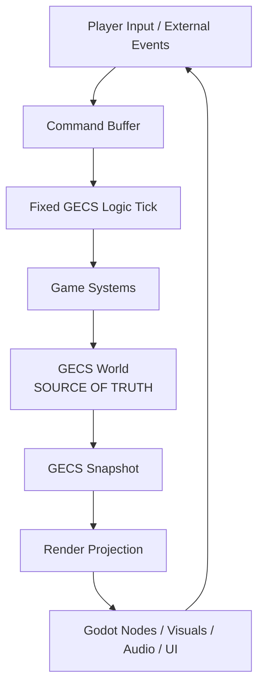

# Project Architecture

This file is the root doctrine only. It does not define AI implementation details. AI, world pressure, squad simulation, combat staging, and render projection details live under `architecture/GameAI/`.

## Core Doctrine

```text
GECS owns truth.
The game updates truth on a fixed logic tick.
Rendering is a side effect of GECS state.
Godot nodes are views, adapters, and input surfaces.
```

## Runtime Shape



## Rules

- GECS stores durable truth: actors, squads, transforms, vitals, inventory, factions, law, settlements, objectives, and world state.
- Gameplay logic advances on a fixed tick. Variable render frame rate must not change simulation outcomes.
- Rendering reads snapshots. It may interpolate, pool, hide, collapse, or decorate state, but it does not own state.
- Nodes may capture input, display state, play animation, play audio, and bridge authored content into GECS.
- Nodes must not decide long-term game truth.
- Scene-authored resources are definitions, not runtime truth.
- Save/load is GECS state first. Render-side objects are recreated from state.

## Fixed Logic First

The target architecture is logic-first:

```text
input -> command buffer -> fixed GECS tick -> GECS snapshot -> render projection
```

The renderer may run at any frame rate. The logic tick remains authoritative.

## Rendering Second

Visuals follow GECS records.

```text
GECS actor transform -> visual transform
GECS action state -> animation state
GECS inventory/equipment -> rendered equipment
GECS combat beat -> hit/block/dodge animation
```

If performance drops, presentation quality can be reduced. Truth must not change.

## Out Of Scope For This Root Doc

- World pressure and encounter selection.
- PuppetMaster presentation and simulation LOD.
- Squad objectives.
- Combat beat staging.
- Actor realization and visual throttling.

Those belong in `architecture/GameAI/`.

## Where Docs Live

- `architecture/README.md` is this root GECS-first doctrine.
- `architecture/GameAI/` defines world direction, PuppetMaster, squad objectives, combat beats, fixed tick LOD, and render projection.
- `architecture/core_attributes/` defines shared stat layers and progression rules.
- `architecture/combat/initiative.md` defines shared melee initiative.
- `architecture/combat/hit.md` defines shared hit scoring.
- `architecture/combat/dodge.md` defines shared dodge scoring.
- `architecture/combat/block.md` defines parry and shield block.
- `architecture/combat/crit.md` defines shared crit chance.
- `architecture/combat/damage.md` defines shared cut and blunt damage.
- `architecture/combat/vitals.md` defines KO, recovery coma, dying, and death.
- `architecture/combat/body_weapons.md` defines body weapon profiles.
- `SETUP.md` explains required local setup.
- `ATTRIBUTION.md` tracks licenses and third-party assets.
