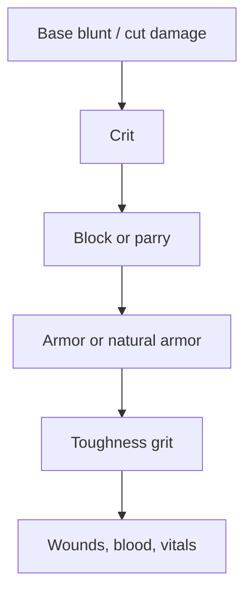

# Damage

Damage is shared by weapon attacks and body weapons.

Damage source profiles define actual base damage values shown to the player.

## Formula

```text
total_base = blunt_base + cut_base

blunt_share = blunt_base / total_base
cut_share = cut_base / total_base

skill_bonus = weapon_skill * 0.20

blunt_damage =
    blunt_base
    + blunt_share * skill_bonus
    + blunt_share * strength * 0.25

cut_damage =
    cut_base
    + cut_share * skill_bonus
    + cut_share * dexterity * 0.25
```

If `total_base` is `0`, both damage values are `0`.

Crit multiplies final `blunt_damage` and `cut_damage` after this formula.

## Resolution Order



## Toughness Grit

Toughness reduces damage after armor.

```text
post_armor_total = blunt_damage + cut_damage

damage_resistance = clamp(toughness * 0.0045, 0.0, 0.45)
grit_soak = toughness * 0.20

prevented_total = min(
    post_armor_total * damage_resistance,
    grit_soak
)
```

Apply prevented damage by damage share:

```text
blunt_damage -= prevented_total * blunt_share
cut_damage -= prevented_total * cut_share
```

If `post_armor_total` is `0`, Toughness prevents `0`.
