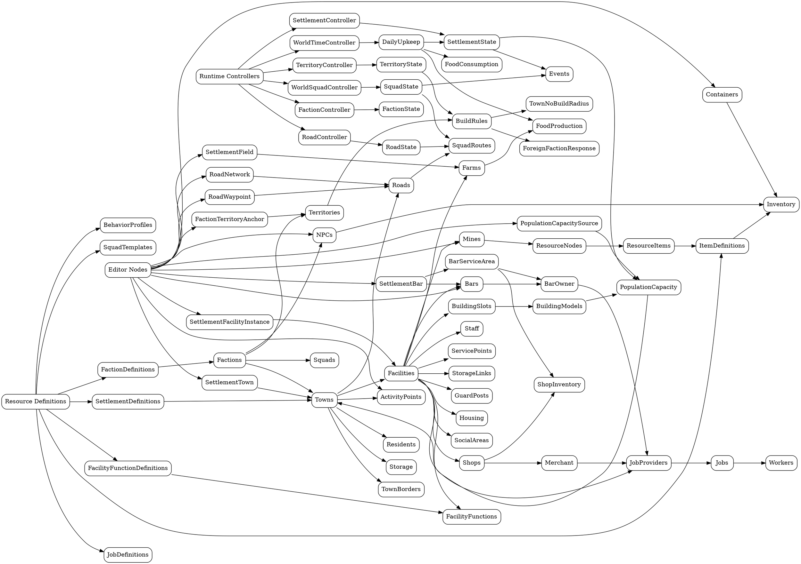

# Game Data

Game data is primarily authored with Godot resources and nodes.

Resources define reusable data such as items, factions, settlement definitions, facility function definitions, behavior profiles, squad templates, prices, stock, jobs, race data, and body archetypes.

Scene nodes define authored world composition such as towns, facilities, NPCs, containers, bars, mines, activity points, territory anchors, road networks, road waypoints, population capacity sources, buildings, and debug objects.

## Node Data Graph

Keep this graph current when world-sim data relationships change.

## Definitions Versus State

Definitions answer: what is this thing supposed to be?

Runtime state answers: what is true right now?

Examples:

- `ItemDefinition` defines an item type; inventory data stores item counts and ownership state.
- `FactionDefinition` defines faction defaults; `FactionController` stores reputation and discovered faction state.
- `SettlementDefinition` defines town identity, faction, behavior, food defaults, and world-sim targets; `SettlementController` stores food, population, events, and facility totals.
- `FacilityFunctionDefinition` defines what a placed facility does, such as bar, farm, shop, police, weapon shop, armor shop, travel shop, potion shop, tavern, mine, or storage.
- `SettlementFacilityInstance` bridges the placed building slot, staff, service points, storage links, jobs, and activity points into a serializable facility record.
- `SettlementBar` is the operator-facing reusable bar asset; its internal `BarServiceArea` coordinates waiter service, bed rental, and barkeeper stock handoff.
- `SettlementTown` and child nodes define authored town layout; controllers use stable IDs to serialize the town's runtime truth.
- `RoadNetwork` and child `RoadWaypoint` nodes define authored invisible route graphs between stable settlement IDs; `RoadController` stores road records and provides shortest route waypoints for squad actions.
- `WorldBuilding.population_capacity` and `PopulationCapacitySource` define authored housing/camp capacity; `SettlementController.max_occupancy` is derived from those sources.

## Stable IDs

Anything referenced by save data, world simulation, faction logic, server records, or long-lived events needs a stable ID.

Use IDs like `farmer_crossing`, `raider_camp`, `Farmers`, `Raiders`, `farmer_crossing.farm_fields`, `farmer_crossing.bar`, `farmer_crossing.house_a`, `farmer_crossing_raider_camp`, `bar`, and `npc.farmer_crossing.01`.

Do not rely on node names or `NodePath` values as permanent identity when the state may need to persist or replicate.

Node paths are acceptable for editor-local wiring, such as a bar pointing to its owner, a job provider pointing to resources, or an activity point pointing to a target node.

## Scene Data

Scenes should compose reusable systems.

Scenes may place a `SettlementTown`, facility instances, containers, NPCs, roads, labels, debug buttons, buildings, and activity markers.

Scenes must not own unique gameplay behavior that only works in that scene.

If a scene needs new behavior, add it as a reusable script, controller, resource, or scene contract first.

## Resource Data

Resources should be portable and reusable.

Prefer resources for data that should be reused across scenes or stored as a definition in future save/DB records.

Prefer nodes for data that is spatial, editor-authored, and scene-composed.

When in doubt, use a resource for the reusable definition and a node for the placed instance.
