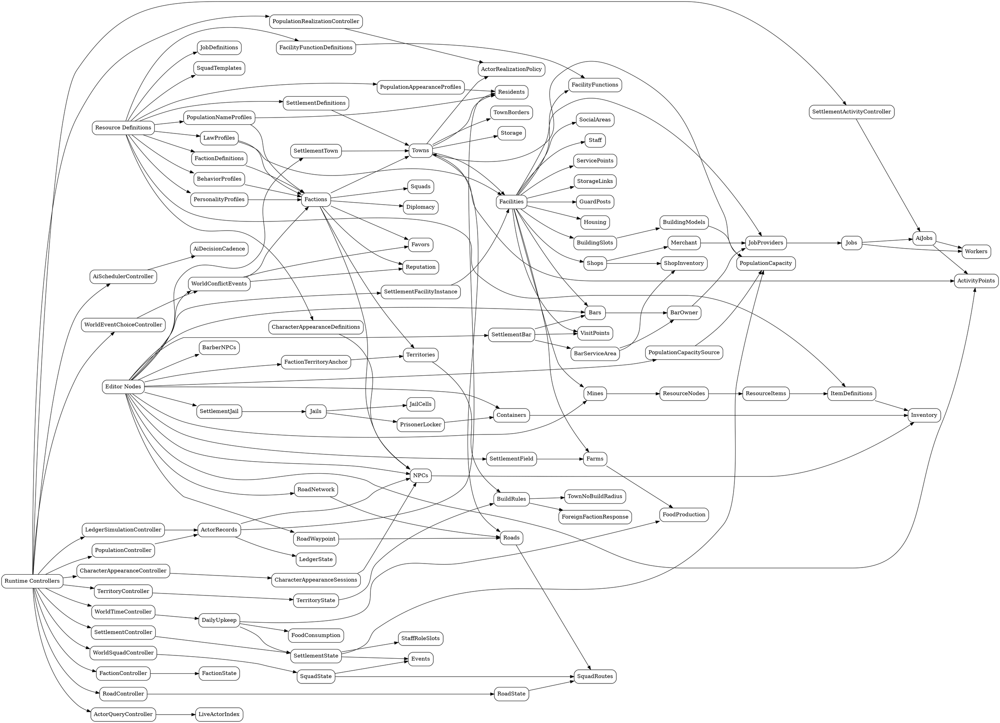

# Game Data

Game data is primarily authored with Godot resources and nodes.

Resources define reusable data such as items, factions, settlement definitions, facility function definitions, behavior profiles, personality profiles, law profiles, squad templates, prices, stock, jobs, race data, body archetypes, character appearance data, generated population appearance and name profiles, and head attachment style definitions.

Scene nodes define authored world composition such as towns, facilities, NPCs, barber NPCs, containers, bars, mines, activity points, territory anchors, road networks, road waypoints, population capacity sources, world conflict events, buildings, and debug objects.

## Node Data Graph

Keep this graph current when world-sim data relationships change.

```dot
digraph GameData {
  rankdir=LR;
  node [shape=box, style="rounded"];

  Resources [label="Resource Definitions"];
  Nodes [label="Editor Nodes"];
  Controllers [label="Runtime Controllers"];

  Resources -> FactionDefinitions;
  Resources -> SettlementDefinitions;
  Resources -> ItemDefinitions;
  Resources -> JobDefinitions;
  Resources -> FacilityFunctionDefinitions;
  Resources -> BehaviorProfiles;
  Resources -> PersonalityProfiles;
  Resources -> LawProfiles;
  Resources -> SquadTemplates;
  Resources -> CharacterAppearanceDefinitions;
  Resources -> PopulationAppearanceProfiles;
  Resources -> PopulationNameProfiles;

  Nodes -> SettlementTown;
  Nodes -> FactionTerritoryAnchor;
  Nodes -> RoadNetwork;
  Nodes -> RoadWaypoint;
  Nodes -> PopulationCapacitySource;
  Nodes -> NPCs;
  Nodes -> BarberNPCs;
  Nodes -> Containers;
  Nodes -> Bars;
  Nodes -> Mines;
  Nodes -> ActivityPoints;
  Nodes -> SettlementFacilityInstance;
  Nodes -> SettlementBar;
  Nodes -> SettlementField;
  Nodes -> SettlementJail;
  Nodes -> WorldConflictEvents;

  FactionDefinitions -> Factions;
  BehaviorProfiles -> Factions;
  PersonalityProfiles -> Factions;
  LawProfiles -> Factions;
  PopulationNameProfiles -> Factions;
  Factions -> Territories;
  Factions -> Towns;
  Factions -> Squads;
  Factions -> NPCs;
  Factions -> Diplomacy;
  Factions -> Reputation;
  Factions -> Favors;

  FactionTerritoryAnchor -> Territories;
  Territories -> BuildRules;
  BuildRules -> ForeignFactionResponse;
  BuildRules -> TownNoBuildRadius;

  RoadNetwork -> Roads;
  RoadWaypoint -> Roads;
  Roads -> SquadRoutes;

  SettlementDefinitions -> Towns;
  SettlementTown -> Towns;
  Towns -> Facilities;
  Towns -> Residents;
  Towns -> ActorRealizationPolicy;
  PopulationAppearanceProfiles -> Residents;
  PopulationNameProfiles -> Residents;
  LawProfiles -> Facilities;
  Towns -> Storage;
  Towns -> TownBorders;
  Towns -> ActivityPoints;
  Towns -> Roads;
  WorldConflictEvents -> Factions;
  WorldConflictEvents -> Reputation;
  WorldConflictEvents -> Favors;

  SettlementFacilityInstance -> Facilities;
  FacilityFunctionDefinitions -> FacilityFunctions;
  Facilities -> FacilityFunctions;
  Facilities -> BuildingSlots;
  Facilities -> Staff;
  Facilities -> ServicePoints;
  Facilities -> JobProviders;
  Facilities -> StorageLinks;
  Facilities -> VisitPoints;
  Facilities -> Farms;
  Facilities -> Bars;
  Facilities -> Shops;
  Facilities -> Mines;
  Facilities -> GuardPosts;
  Facilities -> Housing;
  Facilities -> SocialAreas;
  SettlementBar -> Bars;
  SettlementBar -> BarServiceArea;
  SettlementBar -> VisitPoints;
  SettlementField -> Farms;
  SettlementJail -> Jails;
  Jails -> JailCells;
  Jails -> PrisonerLocker;
  BuildingSlots -> BuildingModels;
  BuildingModels -> PopulationCapacity;
  PopulationCapacitySource -> PopulationCapacity;
  PopulationCapacity -> Towns;

  Bars -> BarOwner;
  BarServiceArea -> BarOwner;
  BarServiceArea -> ShopInventory;
  Shops -> Merchant;
  Mines -> ResourceNodes;
  Farms -> FoodProduction;

  BarOwner -> JobProviders;
  Merchant -> JobProviders;
  JobProviders -> Jobs;
  Jobs -> Workers;
  Jobs -> AiJobs;

  NPCs -> Inventory;
  Containers -> Inventory;
  PrisonerLocker -> Containers;
  Shops -> ShopInventory;
  ItemDefinitions -> Inventory;
  ResourceNodes -> ResourceItems;
  ResourceItems -> ItemDefinitions;

  Controllers -> FactionController;
  Controllers -> SettlementController;
  Controllers -> TerritoryController;
  Controllers -> RoadController;
  Controllers -> WorldSquadController;
  Controllers -> WorldTimeController;
  Controllers -> CharacterAppearanceController;
  Controllers -> WorldEventChoiceController;
  Controllers -> ActorQueryController;
  Controllers -> AiSchedulerController;
  Controllers -> PopulationController;
  Controllers -> PopulationRealizationController;
  Controllers -> LedgerSimulationController;
  Controllers -> SettlementActivityController;

  FactionController -> FactionState;
  SettlementController -> SettlementState;
  TerritoryController -> TerritoryState;
  RoadController -> RoadState;
  WorldSquadController -> SquadState;
  WorldTimeController -> DailyUpkeep;
  CharacterAppearanceController -> CharacterAppearanceSessions;
  WorldEventChoiceController -> WorldConflictEvents;
  ActorQueryController -> LiveActorIndex;
  AiSchedulerController -> AiDecisionCadence;
  PopulationController -> ActorRecords;
  PopulationRealizationController -> ActorRealizationPolicy;
  LedgerSimulationController -> ActorRecords;
  SettlementActivityController -> AiJobs;

  DailyUpkeep -> FoodProduction;
  DailyUpkeep -> FoodConsumption;
  DailyUpkeep -> SettlementState;
  ActorRecords -> Residents;
  ActorRecords -> NPCs;
  ActorRecords -> LedgerState;
  AiJobs -> ActivityPoints;
  AiJobs -> Workers;
  CharacterAppearanceSessions -> NPCs;
  CharacterAppearanceDefinitions -> NPCs;
  SettlementState -> Events;
  SettlementState -> PopulationCapacity;
  SettlementState -> StaffRoleSlots;
  SquadState -> Events;
  SquadState -> SquadRoutes;
  TerritoryState -> BuildRules;
  RoadState -> SquadRoutes;
}
```

## Definitions Versus State

Definitions answer: what is this thing supposed to be?

Runtime state answers: what is true right now?

Examples:

- `ItemDefinition` defines an item type; `InventoryData` stores item counts, contained item counts, and per-entry metadata such as stolen ownership, prisoner-case, and expiry data.
- `FactionDefinition` defines faction defaults including behavior, personality, law, population names, and starting formal diplomacy; `FactionController` stores formal diplomacy, reputation, favor points, and discovered faction state.
- `SettlementDefinition` defines town identity, faction, optional local culture overrides, food defaults, and world-sim targets; `SettlementController` stores food, total population, available labor, assigned role counts, staff vacancies, events, and facility totals.
- `FacilityFunctionDefinition` defines what a placed facility does, such as bar, farm, shop, police, weapon shop, armor shop, travel shop, potion shop, tavern, mine, or storage.
- `SettlementFacilityInstance` bridges the placed building slot, staff, service points, optional storage links, optional jobs, and optional activity points into a serializable facility record. Empty root paths mean the facility does not use that bucket.
- `SettlementBar` is the operator-facing reusable bar asset; its internal `BarServiceArea` coordinates waiter service, bed rental, and barkeeper stock handoff, while `FacilityVisitActivityPoint` assigns normal townie visitors to real furniture seats through the settlement activity AI job path.
- `PopulationController` owns persistent `ActorRecord` state for generated residents and authored humanoids. Actor records snapshot identity, settlement, role, faction, appearance, equipment, inventory, skills, life state, realization state, ledger elapsed time, and last world position.
- `PopulationRealizationController` applies each `SettlementTown.actor_realization_policy` to decide which actor records become live scene actors. The default policy is `full_town`; larger towns can choose `important_plus_near` or `near_player` when ledger behavior is sufficient.
- `LedgerSimulationController` advances non-realized actor records from world time. It should update controller records, not unloaded scene nodes.
- `ActorQueryController` is the runtime index for live actor lookup. Systems that need broad actor queries should use it instead of scanning humanoid groups repeatedly.
- `AiSchedulerController` staggers decision ticks so autonomous NPC thinking is not done for every actor every frame.
- `AiBrain`, `AiJob`, `AiJobDriver`, and `AiTaskStep` are the live AI job path. Activity, work, combat, and future behavior packages should go through jobs and use `HumanoidCharacter` as the actuator.
- `SettlementJail` is the reusable jail facility asset. It owns a building slot, entry point, warden and jail guard role slots, guard posts, lockable cell records, and prisoner locker storage. Its cells are instances of `scenes/world_sim/jail_cell.tscn`; its prisoner locker is an instance of `scenes/world/containers/prisoner_locker_container.tscn`.
- `LawOrderController` owns local crime and custody runtime state: witnessed crimes become faction warrants, stolen items carry metadata immediately, unconscious wanted actors are carried by guard-role authority actors into jail or ejected if no jail exists, and world time releases prisoners after sentence expiry.
- Staff role slots are controller-visible records with stable slot IDs, role IDs, actor paths when realized, authority scope, population cost, and replacement timing. The controller keeps the ledger truth so far-away settlements can run abstractly while near settlements realize physical actors.
- `SettlementTown` and child nodes define authored town layout; controllers use stable IDs to serialize the town's runtime truth.
- `RoadNetwork` and child `RoadWaypoint` nodes define authored invisible route graphs between stable settlement IDs; `RoadController` stores road records and provides shortest route waypoints for squad actions.
- `WorldBuilding.population_capacity` and `PopulationCapacitySource` define authored housing/camp capacity; `SettlementController.max_occupancy` is derived from those sources.
- `PopulationAppearanceProfile` defines reusable generated-resident rules for allowed races, allowed sex/body types, outfit pools, natural hair/skin palettes, hair/beard styles, and conservative skeleton variation.
- `PopulationNameProfile` defines reusable generated-resident display name rules for body-specific names, neutral names, wasteland nicknames, uniqueness retries, and low-probability repeats after a pool is exhausted.
- `FactionPersonalityProfile` defines operator-editable cultural tendencies for negotiation and future behavior trees, such as aggression, risk tolerance, mercy, greed, openness, honor, and patience.
- `FactionLawProfile` defines operator-editable legal customs while keeping the common baseline of no killing, stealing, or trespassing; settlements can override it for local customs.
- `WorldConflictEvent` defines a local player choice in a nearby faction conflict. It grants reputation and favor only after the player chooses a side and satisfies participation.
- `CharacterAppearanceData` defines the actor's current race, sex/body type, body adjusters, custom skin color, and head-attachment choices; barber edits work on a draft and only update the actor on save.
- `HeadAttachmentStyleDefinition` resources define reusable hair, beard, and automatic body-specific eyebrow visual scenes; eyebrow color follows hair color.

## Stable IDs

Anything referenced by save data, world simulation, faction logic, server records, or long-lived events needs a stable ID.

Use IDs like `farmer_crossing`, `raider_camp`, `Farmers`, `Raiders`, `farmer_crossing.farm_fields`, `farmer_crossing.bar`, `farmer_crossing.house_a`, `farmer_crossing_raider_camp`, `bar`, and `npc.farmer_crossing.01`.

Generated population records should use deterministic actor IDs such as `farmer_crossing.resident.001`. Authored NPCs without explicit stable IDs may receive settlement-relative IDs from `PopulationController`, but important named actors should still be assigned readable stable IDs in the editor.

Do not rely on node names or `NodePath` values as permanent identity when the state may need to persist or replicate.

Node paths are acceptable for editor-local wiring, such as a bar pointing to its owner, a job provider pointing to resources, or an activity point pointing to a target node.

## Scene Data

Scenes should compose reusable systems.

Scenes may place a `SettlementTown`, facility instances, containers, NPCs, roads, labels, debug buttons, buildings, and activity markers.

Scenes must not own unique gameplay behavior that only works in that scene.

If a scene needs new behavior, add it as a reusable script, controller, resource, or scene contract first.

## Resource Data

Resources should be portable and reusable.

Prefer resources for data that should be reused across scenes or stored as a definition in future save/DB records.

Prefer nodes for data that is spatial, editor-authored, and scene-composed.

When in doubt, use a resource for the reusable definition and a node for the placed instance.
