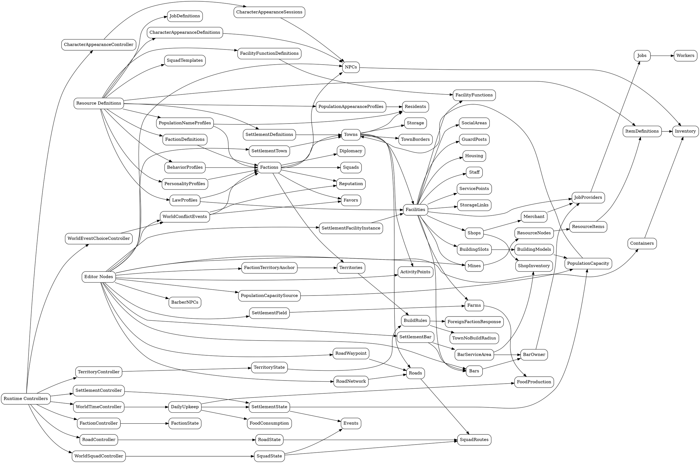

# Game Data

Game data is primarily authored with Godot resources and nodes.

Resources define reusable data such as items, factions, settlement definitions, facility function definitions, behavior profiles, personality profiles, law profiles, squad templates, prices, stock, jobs, race data, body archetypes, character appearance data, generated population appearance and name profiles, and head attachment style definitions.

Scene nodes define authored world composition such as towns, facilities, NPCs, barber NPCs, containers, bars, mines, activity points, territory anchors, road networks, road waypoints, population capacity sources, world conflict events, buildings, and debug objects.

## Node Data Graph

Keep this graph current when world-sim data relationships change.

```dot
digraph GameData {
  rankdir=LR;
  node [shape=box, style="rounded"];

  Resources [label="Resource Definitions"];
  Nodes [label="Editor Nodes"];
  Controllers [label="Runtime Controllers"];

  Resources -> FactionDefinitions;
  Resources -> SettlementDefinitions;
  Resources -> ItemDefinitions;
  Resources -> JobDefinitions;
  Resources -> FacilityFunctionDefinitions;
  Resources -> BehaviorProfiles;
  Resources -> PersonalityProfiles;
  Resources -> LawProfiles;
  Resources -> SquadTemplates;
  Resources -> CharacterAppearanceDefinitions;
  Resources -> PopulationAppearanceProfiles;
  Resources -> PopulationNameProfiles;

  Nodes -> SettlementTown;
  Nodes -> FactionTerritoryAnchor;
  Nodes -> RoadNetwork;
  Nodes -> RoadWaypoint;
  Nodes -> PopulationCapacitySource;
  Nodes -> NPCs;
  Nodes -> BarberNPCs;
  Nodes -> Containers;
  Nodes -> Bars;
  Nodes -> Mines;
  Nodes -> ActivityPoints;
  Nodes -> SettlementFacilityInstance;
  Nodes -> SettlementBar;
  Nodes -> SettlementField;
  Nodes -> WorldConflictEvents;

  FactionDefinitions -> Factions;
  BehaviorProfiles -> Factions;
  PersonalityProfiles -> Factions;
  LawProfiles -> Factions;
  PopulationNameProfiles -> Factions;
  Factions -> Territories;
  Factions -> Towns;
  Factions -> Squads;
  Factions -> NPCs;
  Factions -> Diplomacy;
  Factions -> Reputation;
  Factions -> Favors;

  FactionTerritoryAnchor -> Territories;
  Territories -> BuildRules;
  BuildRules -> ForeignFactionResponse;
  BuildRules -> TownNoBuildRadius;

  RoadNetwork -> Roads;
  RoadWaypoint -> Roads;
  Roads -> SquadRoutes;

  SettlementDefinitions -> Towns;
  SettlementTown -> Towns;
  Towns -> Facilities;
  Towns -> Residents;
  PopulationAppearanceProfiles -> Residents;
  PopulationNameProfiles -> Residents;
  LawProfiles -> Facilities;
  Towns -> Storage;
  Towns -> TownBorders;
  Towns -> ActivityPoints;
  Towns -> Roads;
  WorldConflictEvents -> Factions;
  WorldConflictEvents -> Reputation;
  WorldConflictEvents -> Favors;

  SettlementFacilityInstance -> Facilities;
  FacilityFunctionDefinitions -> FacilityFunctions;
  Facilities -> FacilityFunctions;
  Facilities -> BuildingSlots;
  Facilities -> Staff;
  Facilities -> ServicePoints;
  Facilities -> JobProviders;
  Facilities -> StorageLinks;
  Facilities -> Farms;
  Facilities -> Bars;
  Facilities -> Shops;
  Facilities -> Mines;
  Facilities -> GuardPosts;
  Facilities -> Housing;
  Facilities -> SocialAreas;
  SettlementBar -> Bars;
  SettlementBar -> BarServiceArea;
  SettlementField -> Farms;
  BuildingSlots -> BuildingModels;
  BuildingModels -> PopulationCapacity;
  PopulationCapacitySource -> PopulationCapacity;
  PopulationCapacity -> Towns;

  Bars -> BarOwner;
  BarServiceArea -> BarOwner;
  BarServiceArea -> ShopInventory;
  Shops -> Merchant;
  Mines -> ResourceNodes;
  Farms -> FoodProduction;

  BarOwner -> JobProviders;
  Merchant -> JobProviders;
  JobProviders -> Jobs;
  Jobs -> Workers;

  NPCs -> Inventory;
  Containers -> Inventory;
  Shops -> ShopInventory;
  ItemDefinitions -> Inventory;
  ResourceNodes -> ResourceItems;
  ResourceItems -> ItemDefinitions;

  Controllers -> FactionController;
  Controllers -> SettlementController;
  Controllers -> TerritoryController;
  Controllers -> RoadController;
  Controllers -> WorldSquadController;
  Controllers -> WorldTimeController;
  Controllers -> CharacterAppearanceController;
  Controllers -> WorldEventChoiceController;

  FactionController -> FactionState;
  SettlementController -> SettlementState;
  TerritoryController -> TerritoryState;
  RoadController -> RoadState;
  WorldSquadController -> SquadState;
  WorldTimeController -> DailyUpkeep;
  CharacterAppearanceController -> CharacterAppearanceSessions;
  WorldEventChoiceController -> WorldConflictEvents;

  DailyUpkeep -> FoodProduction;
  DailyUpkeep -> FoodConsumption;
  DailyUpkeep -> SettlementState;
  CharacterAppearanceSessions -> NPCs;
  CharacterAppearanceDefinitions -> NPCs;
  SettlementState -> Events;
  SettlementState -> PopulationCapacity;
  SquadState -> Events;
  SquadState -> SquadRoutes;
  TerritoryState -> BuildRules;
  RoadState -> SquadRoutes;
}
```

## Definitions Versus State

Definitions answer: what is this thing supposed to be?

Runtime state answers: what is true right now?

Examples:

- `ItemDefinition` defines an item type; inventory data stores item counts and ownership state.
- `FactionDefinition` defines faction defaults including behavior, personality, law, population names, and starting formal diplomacy; `FactionController` stores formal diplomacy, reputation, favor points, and discovered faction state.
- `SettlementDefinition` defines town identity, faction, optional local culture overrides, food defaults, and world-sim targets; `SettlementController` stores food, population, events, and facility totals.
- `FacilityFunctionDefinition` defines what a placed facility does, such as bar, farm, shop, police, weapon shop, armor shop, travel shop, potion shop, tavern, mine, or storage.
- `SettlementFacilityInstance` bridges the placed building slot, staff, service points, storage links, jobs, and activity points into a serializable facility record.
- `SettlementBar` is the operator-facing reusable bar asset; its internal `BarServiceArea` coordinates waiter service, bed rental, and barkeeper stock handoff.
- `SettlementTown` and child nodes define authored town layout; controllers use stable IDs to serialize the town's runtime truth.
- `RoadNetwork` and child `RoadWaypoint` nodes define authored invisible route graphs between stable settlement IDs; `RoadController` stores road records and provides shortest route waypoints for squad actions.
- `WorldBuilding.population_capacity` and `PopulationCapacitySource` define authored housing/camp capacity; `SettlementController.max_occupancy` is derived from those sources.
- `PopulationAppearanceProfile` defines reusable generated-resident rules for allowed races, allowed sex/body types, outfit pools, natural hair/skin palettes, hair/beard styles, and conservative skeleton variation.
- `PopulationNameProfile` defines reusable generated-resident display name rules for body-specific names, neutral names, wasteland nicknames, uniqueness retries, and low-probability repeats after a pool is exhausted.
- `FactionPersonalityProfile` defines operator-editable cultural tendencies for negotiation and future behavior trees, such as aggression, risk tolerance, mercy, greed, openness, honor, and patience.
- `FactionLawProfile` defines operator-editable legal customs while keeping the common baseline of no killing, stealing, or trespassing; settlements can override it for local customs.
- `WorldConflictEvent` defines a local player choice in a nearby faction conflict. It grants reputation and favor only after the player chooses a side and satisfies participation.
- `CharacterAppearanceData` defines the actor's current race, sex/body type, body adjusters, custom skin color, and head-attachment choices; barber edits work on a draft and only update the actor on save.
- `HeadAttachmentStyleDefinition` resources define reusable hair, beard, and automatic body-specific eyebrow visual scenes; eyebrow color follows hair color.

## Stable IDs

Anything referenced by save data, world simulation, faction logic, server records, or long-lived events needs a stable ID.

Use IDs like `farmer_crossing`, `raider_camp`, `Farmers`, `Raiders`, `farmer_crossing.farm_fields`, `farmer_crossing.bar`, `farmer_crossing.house_a`, `farmer_crossing_raider_camp`, `bar`, and `npc.farmer_crossing.01`.

Do not rely on node names or `NodePath` values as permanent identity when the state may need to persist or replicate.

Node paths are acceptable for editor-local wiring, such as a bar pointing to its owner, a job provider pointing to resources, or an activity point pointing to a target node.

## Scene Data

Scenes should compose reusable systems.

Scenes may place a `SettlementTown`, facility instances, containers, NPCs, roads, labels, debug buttons, buildings, and activity markers.

Scenes must not own unique gameplay behavior that only works in that scene.

If a scene needs new behavior, add it as a reusable script, controller, resource, or scene contract first.

## Resource Data

Resources should be portable and reusable.

Prefer resources for data that should be reused across scenes or stored as a definition in future save/DB records.

Prefer nodes for data that is spatial, editor-authored, and scene-composed.

When in doubt, use a resource for the reusable definition and a node for the placed instance.
